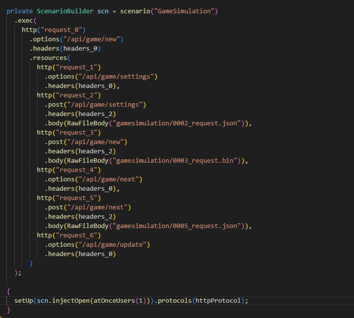
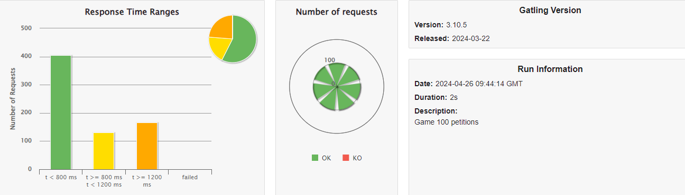
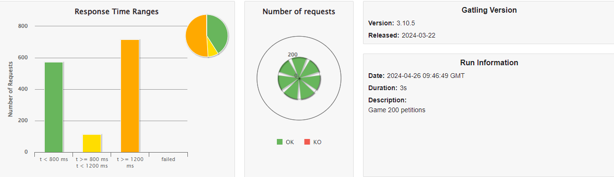
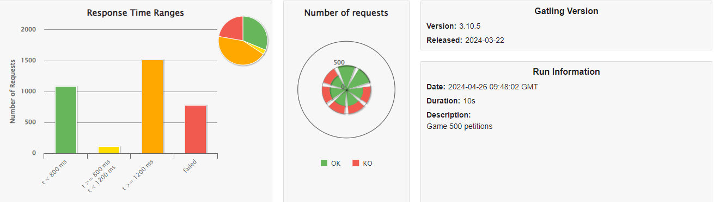
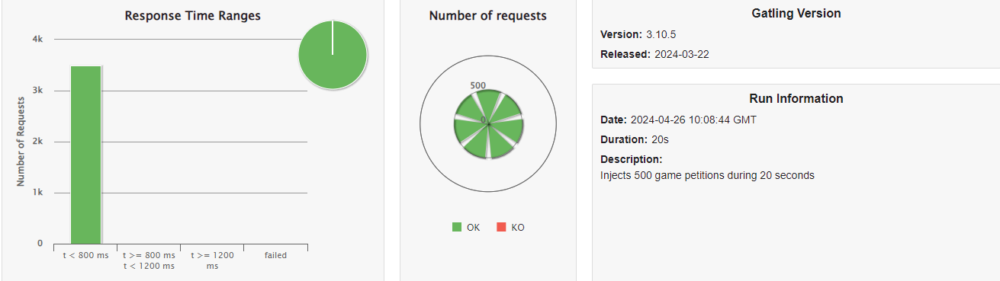
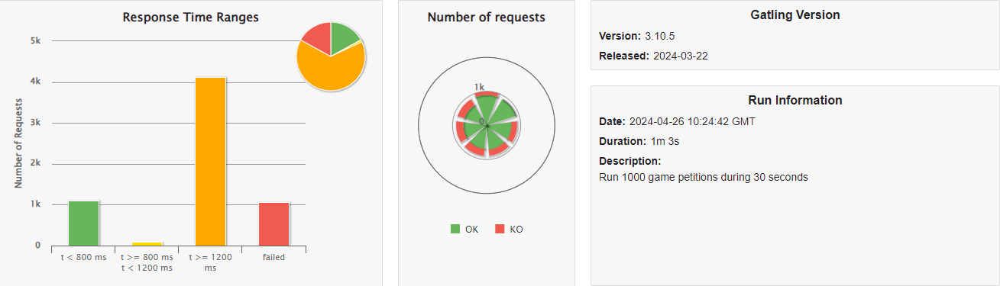
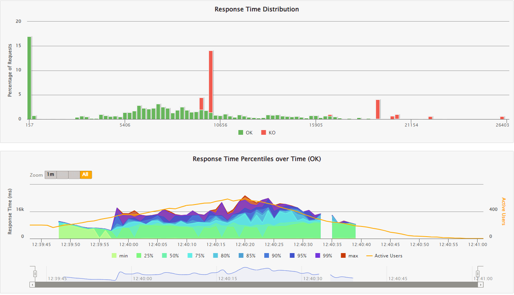
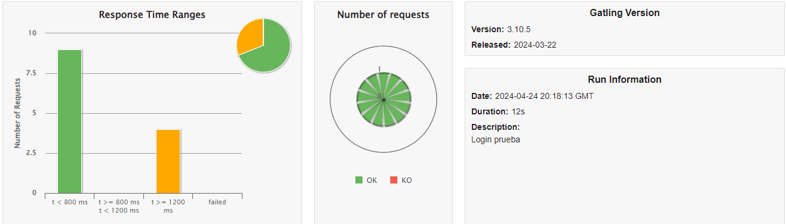

ifndef::imagesdir[:imagesdir: ../images]

[[section-testing-report]]
== Testing Report

=== Unit Tests

Each component has its own unit tests that verify its functionality acts correctly, thus providing security and robustness to the project.

==== Code coverage result

We use the Sonar tool to ensure that the code is well covered by tests, so that if there is less than 80% of uncovered code or if there is more than 3% of code duplications, it raises an error and we cannot integrate our changes until we have the minimum coverage

image:12_code_coverage.png[arc42]

It was challenging for us to maintain the code coverage at 80%, either due to our lack of experience with this tool or because it didn't function correctly. Some tests have decreased the coverage, while others have inflated it beyond what accurately reflects the security of the code.
Nonetheless, it has helped us to develop numerous unit tests and make the project very robust.

=== Acceptance Tests

With acceptance tests, we aim to automatically verify that our system meets the requirements, confirm the integrity of our system with Wikidata, and detect any unexpected issues that may arise unnoticed.

* We focus our efforts on testing the following features
** Registering a new User
** Playing a game
** Playing game different modes

=== Load tests

Load tests measure performance in advance of normal load or peak load. To carry out these tests we have used the tool Gatling, which allows to record an example of use and change the amount of load on it.

As one of our quality goals is performance efficiency, we have focused our tests on measuring the performance of our question cache, which we explain in our ADR:  https://github.com/Arquisoft/wiq_es1c/wiki/ADR-11-%28Question-Cache%29[ADR 11].

The first step was recording the start of a normal game to see how it loads the question. We will add all the results we got from Gatling in a folder in the documentation section, in case you want to consult it in depth.

This is part of the code that it generated:

As we are quite confident in our cache, we will start with 100 current petitions:

As you can see in 2 seconds we can manage 100 petitions without failing any requests.
The same happens with 200 petitions which only takes 3 seconds.

The problems start around the 500 petitions where some requests start fail due to time out exceptions, however around 80% of the request finish correctly and it only takes 10 seconds to finish.

We consider that been able to put up with more than 200 petitions at the same time is a quite good result.
We have made more load test, for example load 500 petitions distributed in 20 seconds, which has great results.

And also load 1000 petitions during 30 seconds which was pretty fast, however some of the requests failed.

And to finish with those related to the cache, we have included int the code some of the options that Gatling provides and mixed them.
The code for the las simulation is `atOnceUsers(200),nothingFor(5),rampUsers(500).during(20),constantUsersPerSec(30).during(15).randomized()`.
Which at first loads 200 petitions at once, then waits for 5 seconds, loads 500 petitions distributed in 20 seconds and finally loads 30 petitions constant during 15 seconds at a randomized interval.
In this graphic we can analyze that the problem with this tests is when the 500 distributed petitions and the 30 constant petitions.

The other part that we have considered important to measure is the time which take an user to login, we have made this process slow because it helps to avoid brute force attacks.
As you can see in the test a single user takes 12 seconds which is more than 500 petitions to the game service.

=== Usability tests

We have consider that usability is one of the most important aspects in a game because people external to the project can see problems or design mistakes that
we may overlook.
For that reason we have consider advisable to make usability tests.

As we had to develop this project in such a short time we didn't have time to make proper usability test, for that reason we will take as a reference the chapter
9 of the book "Don't Make Me Think" ,written by Steve Krug, named "Usability testing on 10 cents a day".

We have tested 6 different users which we have organized in three groups (2 per group) : the ones which also study our degree, but are in another projects; the ones who have
high computer expertise because they study something related to technology and the ones who hardly use a computer.

Before the test we gave the each participant a brief explanation about the game, but without going into much detail because we wanted them to discover the functionality of the game.

We have summed up the main negative aspects that each user stood out, however in general they liked the application and enjoyed playing,
and group them in the groups we have explained before.

==== Group 1: Study our degree

* Don't understand what tags stands for.
* You can enter the game configuration during the game, so it should show a pop up informing that you will end the game you are playing.
* When you try to sign off it should show a confirmation message.
* Can be a good idea not to allow internationalize while you are playing the game.
* A lot of unused space on the sides of the screen.

==== Group 2: High computer expertise

* Don't understand what tags stands for.
* A lot of unused space on the sides of the screen.
* Implement help in the questions, for example rule out one of the fake questions.
* Don't like that the ranking shows their scores to the other players without consent.

==== Group 3: Hardly use a computer

* Don't understand what tags stands for.
* Very difficult questions.
* Too many sport theme questions.
* Music in the game would be a plus.

We will try to keep in mind those aspects in the development of our app, however as we are at the end of the project and we don't have many time, we will try
to fix and implement those which we consider required or important.

